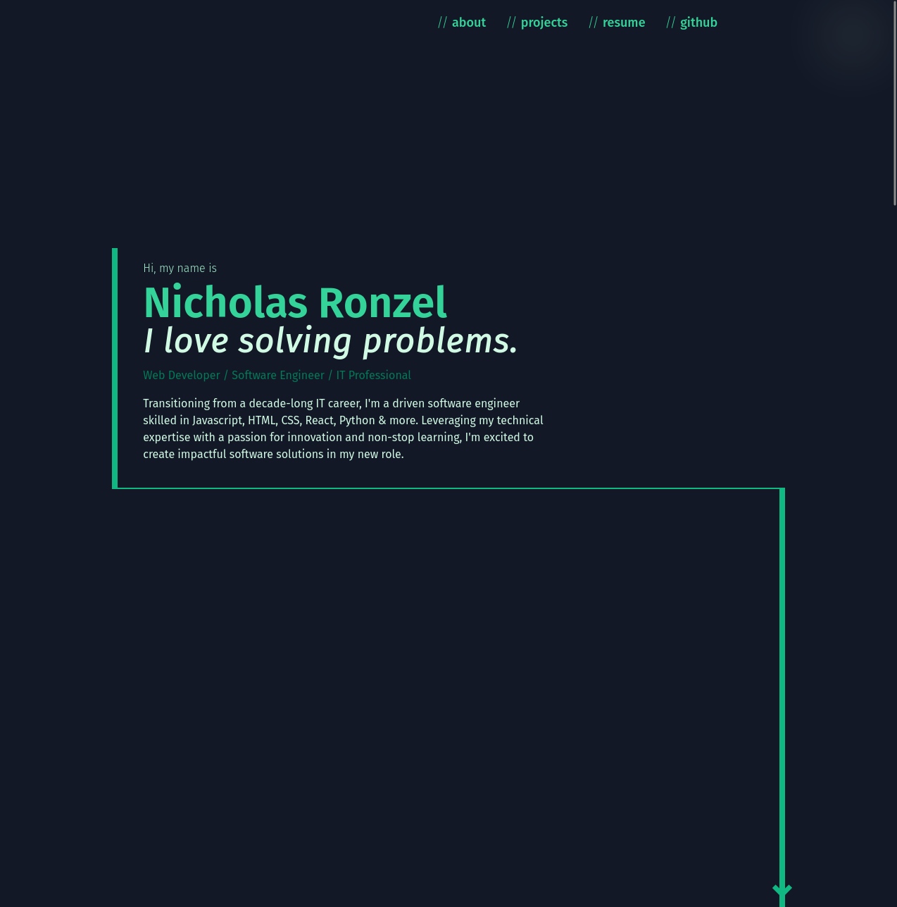

# Portfolio    

## Description

Welcome to my portfolio site! I used this project as a chance to learn SolidJS and TailwindCSS.

I decided on a more monochrome style and I am happy with how it came out.

[Visit the site!](https://nickronzel.com)

I used SolidJS-Use for cleaner functions to handle Intersection Observer and mouse position.

Overall since this project was fairly simple as far as the complexity of the functionality, I focused more on
design and style elements and tried to make something I felt looked good.

